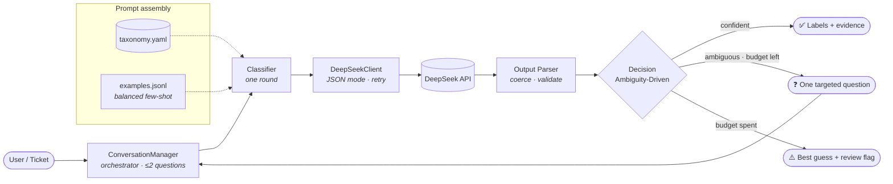
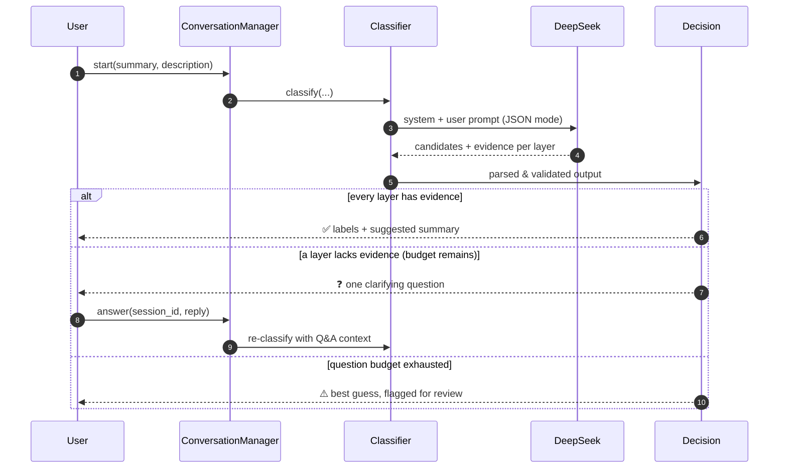

<div align="center">


# Ticket Triage Chatbot

### AI-assisted, two-layer ticket classification with evidence-driven clarification

An employee just describes their problem. The chatbot classifies it on **two
independent layers**, and only when the text is genuinely ambiguous does it ask
**at most two** targeted follow-up questions — grounded in evidence, never in an
uncalibrated confidence score.

<br/>

[](https://www.python.org/)
[](https://fastapi.tiangolo.com/)
[](https://docs.pydantic.dev/)
[](https://deepseek.com/)
[](https://gradio.app/)
[](#-testing)

<br/>

**[Highlights](#-highlights)** · **[Architecture](#-architecture)** · **[Quickstart](#-quickstart)** · **[Usage](#-usage)** · **[Evaluation](#-evaluation--reporting)** · **[Configuration](#-configuration)**

</div>

---

## ✨ Overview

Ticket triage is repetitive, language-mixed, and easy to get subtly wrong. This
project turns a free-text complaint into a structured, routable label set using
a single LLM round, and escalates to a human only when the evidence is truly
insufficient.

Tickets arrive in **Persian, English, or a mix of both** — the system *never
translates*; it reasons in the ticket's original language.

| | |
|---|---|
| 🧭 **Two-layer classification** | **Type** (`Incident` / `Service Request`) and **Domain** (`ERP` / `Staff`), decided independently. |
| 🔎 **Evidence over confidence** | Each label must be backed by spans copied from the ticket. No evidence → ask, don't guess. |
| 💬 **Bounded clarification** | At most **2** follow-up questions, enforced by the orchestrator — not by the model. |
| 🧩 **One source of truth** | Every category, cue, and rule lives in `config/taxonomy.yaml`. Adding a class is a YAML edit, **zero code changes**. |
| 🛡️ **Hardened output** | A defensive parser repairs malformed LLM JSON and drops hallucinated labels — the service never crashes on bad output. |
| 💸 **Cost-aware** | Real token accounting, prompt-cache savings, and presentation-ready HTML/PNG reports for stakeholders. |

---

## 🎯 The two-layer taxonomy

Classification is split into two orthogonal dimensions so each can be reasoned
about — and tuned — independently.

| Layer | Role | Labels | The question it answers |
|:--|:--|:--|:--|
| **`layer1`** | Type / Intent | `incident` · `service_request` | Is something that should work **broken**, or is the user requesting something **new**? |
| **`layer2`** | Domain | `erp` · `staff` | Which **system / department** should route this ticket? |

> [!NOTE]
> **Layer 1 is intentionally Incident-leaning.** This was a data-driven choice:
> on the real corpus, phrasings like *"I can't register"* are ~89% Incident.
> Layer 2 (Domain) was separately corrected from full-dataset statistics so that
> position changes, contracts, and `checkout` route to **ERP**, not Staff. See
> [`CLAUDE.md`](CLAUDE.md) for the full labeling contract and the experiments
> behind it.

---

## 🏗 Architecture

A request flows through a small, single-responsibility pipeline. The
**ConversationManager** orchestrates; the **Classifier** runs exactly one LLM
round; the **Decision** layer turns raw candidates into an action.



<details>
<summary><b>Request lifecycle (sequence view)</b></summary>

<br/>



</details>

### Why Ambiguity-Driven, not a confidence score?

The confidence number an LLM reports about itself is **uncalibrated and
overconfident**. Instead, the model is required to attach *concrete evidence*
(words/phrases copied from the ticket) to every label. A layer is treated as
**ambiguous** only when:

- the model explicitly sets `needs_clarification = true`, **or**
- its top candidate comes back with an **empty evidence list** (an
  anti-overconfidence guard).

A follow-up question is asked **only** when the discriminating information is
genuinely missing from the text — so the bot stays quiet when it shouldn't ask.

---

## 📁 Project structure

```
ChatBot-v2/
├── config/
│   ├── settings.py          # Env, model, thresholds, question budget
│   └── taxonomy.yaml        # ★ Category definitions — the single source of truth
├── data/
│   └── examples.jsonl       # Labeled few-shot examples (balanced, leakage-free)
├── src/
│   ├── taxonomy.py          # Typed loader/wrapper over the YAML
│   ├── llm/
│   │   ├── client.py        # DeepSeek wrapper: JSON mode, retry, self-consistency
│   │   └── prompts.py       # Builds system/user prompts dynamically from taxonomy
│   ├── classifier/
│   │   ├── schema.py        # Pydantic data shapes for model output
│   │   ├── output_parser.py # ★ Coerce / repair / validate raw LLM JSON
│   │   ├── few_shot.py      # Balanced demonstration selection
│   │   ├── classifier.py    # One classification round
│   │   └── decision.py      # ★ Ambiguity-Driven decision logic
│   ├── conversation/
│   │   ├── state.py         # Per-session state
│   │   └── manager.py       # ★ Orchestrator + interaction logging
│   ├── api/app.py           # FastAPI service
│   ├── reporting/cost.py    # Shared cost/token engine (single source of numbers)
│   └── utils/               # normalize · logging · interaction_log
├── scripts/
│   ├── eval_incdb.py        # Single-shot accuracy on the raw dataset
│   ├── report.py            # Visual accuracy + cost dashboard (PNG)
│   ├── cost_report.py       # Standalone HTML cost/token report
│   └── evaluate.py          # Accuracy on a curated Gold Set
├── tests/                   # Offline unit tests (no API needed)
├── cli.py                   # Interactive manual-test CLI
├── app_gradio.py            # Polished Gradio web UI
└── smoke_openrouter.py      # One-ticket smoke test
```

---

## 🚀 Quickstart

> **Prerequisites:** Python 3.10+ and an API key for an OpenAI-compatible
> endpoint (DeepSeek or OpenRouter).

```bash
# 1) Create and activate a virtual environment
python -m venv .venv
source .venv/bin/activate          # Windows: .\.venv\Scripts\Activate.ps1

# 2) Install dependencies
pip install -r requirements.txt

# 3) Configure your key
cp .env.example .env               # then edit .env and set DEEPSEEK_API_KEY
```

<details>
<summary><b>Minimal <code>.env</code></b></summary>

```dotenv
DEEPSEEK_API_KEY=sk-...
DEEPSEEK_BASE_URL=https://api.deepseek.com
DEEPSEEK_MODEL=deepseek-v4-pro
MAX_QUESTIONS=2
```

To run through **OpenRouter** instead, point the base URL and model at it:

```dotenv
DEEPSEEK_API_KEY=sk-or-v1-...
DEEPSEEK_BASE_URL=https://openrouter.ai/api/v1
DEEPSEEK_MODEL=deepseek/deepseek-chat-v3-0324
```

</details>

> The taxonomy/prompt/few-shot logic runs and is fully unit-tested **without** a
> key; only live classification needs one.

---

## 🕹 Usage

### Interactive CLI

```bash
python cli.py
```

Enter a `Summary` and `Description`; if the bot needs to disambiguate, it asks a
question and waits for your reply.

### REST API (FastAPI)

```bash
uvicorn src.api.app:app --reload
# Interactive docs: http://127.0.0.1:8000/docs
```

**Start a classification:**

```bash
curl -X POST http://127.0.0.1:8000/classify/start \
  -H "Content-Type: application/json" \
  -d '{"summary":"خطا در ثبت پانچ","description":"ورود و خروج امروز ثبت نشد"}'
```

**If `status` is `need_info`,** answer the question with the returned `session_id`:

```bash
curl -X POST http://127.0.0.1:8000/classify/answer \
  -H "Content-Type: application/json" \
  -d '{"session_id":"<id>","answer":"..."}'
```

<details>
<summary><b>Response shape</b></summary>

```jsonc
{
  "session_id": "…",
  "status": "completed",            // need_info · completed · completed_low_confidence
  "question": null,                  // set when status == need_info
  "questions_asked": 0,
  "result": {
    "labels":   { "layer1": "incident", "layer2": "erp" },
    "evidence": { "layer1": ["ثبت نشد"], "layer2": ["پانچ", "ورود و خروج"] },
    "suggested_summary": "…",
    "needs_review": false,
    "reasoning": "…"
  }
}
```

| Endpoint | Method | Purpose |
|:--|:--|:--|
| `/classify/start` | `POST` | Begin a session from `summary` + `description`. |
| `/classify/answer` | `POST` | Continue a session with the user's reply. |
| `/health` | `GET` | Liveness probe. |

</details>

### Web UI (Gradio)

```bash
python app_gradio.py
```

A presentation-grade front end over the same backend: switchable dark/light
theme, per-message avatars, an *"Analyzing…"* indicator, colored result badges,
a *needs-review* warning with a short reason, and a raw-JSON debug panel.

---

## 📊 Evaluation & reporting

All evaluation runs **single-shot** (no clarifying questions) to measure raw
model accuracy, and uses **stratified, seeded sampling** so results are
reproducible and directly comparable across versions.

```bash
# Accuracy on a reproducible 20% stratified sample of the 1,633-ticket dataset
python -m scripts.eval_incdb tests/Ticketing_DB.jsonl --frac 0.2 --seed 42 \
  --workers 6 --out preds.jsonl --errors errors.jsonl

# Presentation-grade visual dashboard (KPIs, per-class recall, confusion, cost) → PNG
python -m scripts.report tests/Ticketing_DB.jsonl --frac 0.2 --seed 42 --save report.png

# Accuracy on a curated Gold Set
python -m scripts.evaluate data/gold.jsonl
```

The dashboard renders overall exact-match accuracy (both layers correct),
per-layer accuracy, per-class recall, and a per-layer confusion matrix. As
documented in the engineering notes, the tuned taxonomy reaches **≈89%
exact-match** on the held-out stratified sample.

### 💸 Cost & token economics

DeepSeek bills on **three tiers** (per 1M tokens): cache-miss input, cache-hit
input, and output. Every figure comes from a **single shared engine**
(`src/reporting/cost.py`) so the HTML report and the PNG dashboard never
disagree, and all numbers derive from **real measured usage** — not a
hypothetical calculator.

```bash
# From the production log — no API needed
python -m scripts.cost_report --from-log logs/interactions.jsonl --out cost_report.html

# From a real model run over the dataset — requires an API key
python -m scripts.cost_report tests/Ticketing_DB.jsonl --frac 0.2 --workers 6 \
  --out cost_report.html
```

The self-contained HTML report (open in a browser → *Print → Save as PDF*) shows
KPI cards, token composition, a cost breakdown, prompt-cache savings, unit
economics, and a cost-at-scale projection. Pricing is configurable and labeled
as an explicit assumption in the footer (`--price-in`, `--price-cache`,
`--price-out`).

---

## ⚙️ Configuration

Everything is environment-driven via `config/settings.py`.

| Variable | Default | Description |
|:--|:--|:--|
| `DEEPSEEK_API_KEY` | _(required)_ | API key for the OpenAI-compatible endpoint. |
| `DEEPSEEK_BASE_URL` | `https://api.deepseek.com` | Endpoint base URL (swap for OpenRouter, etc.). |
| `DEEPSEEK_MODEL` | `deepseek-v4-pro` | Model used for classification. |
| `MAX_QUESTIONS` | `2` | Upper bound on follow-up questions per session. |
| `TEMPERATURE` | `0.0` | Sampling temperature (deterministic by default). |
| `REQUEST_TIMEOUT` | `60` | Per-request timeout (seconds). |
| `MAX_RETRIES` | `3` | Retries on network / invalid-JSON errors. |
| `ENABLE_SELF_CONSISTENCY` | `false` | Sample N times and majority-vote for stability. |
| `SELF_CONSISTENCY_SAMPLES` | `3` | Number of votes when self-consistency is on. |
| `INTERACTION_LOG_ENABLED` | `true` | Persist every round/session to JSONL. |
| `INTERACTION_LOG_PATH` | `logs/interactions.jsonl` | Where interactions are written. |

> [!WARNING]
> Interaction logs and `.env` contain **PII and secrets** — tickets include
> names and employee IDs. The `logs/` folder and `.env` are git-ignored and must
> never be committed; define a retention/access policy before production use.

---

## 🧪 Testing

A fast, **offline** suite (no API calls) covers text normalization, taxonomy
loading, schema validation/repair, the Ambiguity-Driven decision, and the full
cost-math engine.

```bash
python -m pytest -q
```

```
18 passed
```

---

## 🧠 Design principles

- **Taxonomy is the single source of truth.** No label name is hard-coded; the
  prompt, schema, and evaluation all read from `config/taxonomy.yaml`.
- **Data-driven, not intuitive.** Rules are validated against the full
  1,633-ticket distribution before they ship; the goal is to remove *systematic*
  bias, not to overfit a handful of noisy errors.
- **No leakage.** Few-shot examples are drawn from outside the evaluation sample.
- **Fail soft, never crash.** Malformed model output degrades a layer to
  "ambiguous" (so the conversation can ask) instead of taking the service down.
- **Reason in the original language.** Persian / English / mixed text is never
  translated.

---

## 🗺 Roadmap

- [ ] **Gold Set** — 150–200 human-verified tickets for a trustworthy accuracy baseline.
- [ ] **Richer few-shot** — more balanced examples across the four label combinations.
- [ ] **Durable sessions** — replace the in-memory store with Redis for production.
- [ ] **Fine-tune / RAG** — leverage the interaction log as future training signal.

---

<div align="center">

<sub>Built for accurate, maintainable, cost-aware ticket triage.</sub>

<sub>See <a href="CLAUDE.md"><code>CLAUDE.md</code></a> for the detailed engineering and labeling contract.</sub>

</div>
